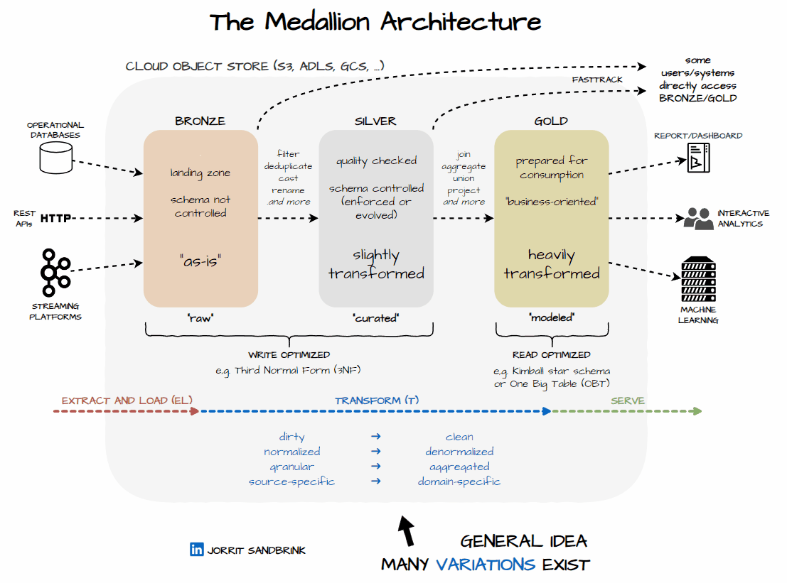

# How to become Data Engineer?

> Watch this below video

## Must go-through (free resources):

> Azure Data factory

- [Azure Data Factory by WafaStudies](https://www.youtube.com/playlist?list=PLMWaZteqtEaLTJffbbBzVOv9C0otal1FO) [Mandatory]
- [Azure Data Factory by Adam Marczak](https://www.youtube.com/playlist?list=PLGjZwEtPN7j8b9dPA0HrtJDptOB69B506) [Mandatory]

---

> Azure Synapse

- [Azure Synapse Analytics by WafaStudies](https://www.youtube.com/playlist?list=PLMWaZteqtEaIZxPCw_0AO1GsqESq3hZc6) [Optional]

---

> Azure Databricks

- [Azure Databricks by WafaStudies](https://www.youtube.com/playlist?list=PLMWaZteqtEaKi4WAePWtCSQCfQpvBT2U1) [Mandatory]
- [Azure Databricks by Adam Marczak](https://www.youtube.com/playlist?list=PLGjZwEtPN7j96btR0XlAIla9T6XPpj9ta) [Mandatory]

---

> Pyspark

- [Pyspark wiki](https://sparkbyexamples.com/pyspark-tutorial/) [Mandatory]
- [Pyspark Notes](https://amrit-hub.github.io/How-to-become-Data-Engineering-Essentials/pyspark/PySpark-notes.pdf) [Interview Questions]

---

> SQL

- [SQL by kudvenkat](https://www.youtube.com/playlist?list=PL08903FB7ACA1C2FB) [Mandatory]
- [SQL Practice HackerRank](https://www.hackerrank.com/domains/sql) [Mandatory]
- [SQL Practice Naukri](https://www.naukri.com/code360/problem-lists/top-100-sql-problems) [Mandatory]
- [SQL Practice Datalemur](https://datalemur.com/questions?category=SQL) [Mandatory]

---

> Python

- [Python by Corey Schafer](https://www.youtube.com/playlist?list=PL-osiE80TeTt2d9bfVyTiXJA-UTHn6WwU) [Mandatory]

---

> git

- [Git Essentials by Corey Schafer](https://www.youtube.com/playlist?list=PL-osiE80TeTuRUfjRe54Eea17-YfnOOAx) [Preferred]
- [Git Hindi by CodeWithHarry](https://www.youtube.com/playlist?list=PLu0W_9lII9agwhy658ZPA0MTStKUJTWPi) [Optional]

---

> Azure Fundamentals

- [Azure Data Fundamentals](https://www.youtube.com/playlist?list=PLGjZwEtPN7j-Q59JYso3L4_yoCjj2syrM) [Preferred]

## Spark Advanced videos with slides (must for Interview)

1. [Understanding Query Plans and Spark UIs - Xiao Li Databricks](https://www.youtube.com/watch?v=YgQgJceojJY)
   [[Presentation slides here](https://amrit-hub.github.io/How-to-become-Data-Engineering-Essentials/resources/Understanding_Query_Plans_and_Spark_UIs_-_20240623_103226.pdf)]
2. [Easy, Scalable, Fault Tolerant Stream Processing with Structured Streaming in Apache Spark](https://www.youtube.com/watch?v=_jPKqJ-gaIY)
   [[Presentation slides here](https://amrit-hub.github.io/How-to-become-Data-Engineering-Essentials/resources/Easy,_scalable,_fault_tolerant_stream_processing_with_structured_streaming_-_with_Tathagata_Das_-_20240623_103806.pdf)]
3. [Everyday I&#39;m Shuffling - Tips for Writing Better Apache Spark Programs](https://www.youtube.com/watch?v=Wg2boMqLjCg)
   [[Presentation slides here](https://amrit-hub.github.io/How-to-become-Data-Engineering-Essentials/resources/Everyday_I'm_Shuffling_-_Tips_for_Writing_Better_Spark_Programs,_Strata_San_Jose_2015_-_20240623_104054.pdf)]
4. [Optimizing Apache Spark SQL Joins: Spark Summit East talk by Vida Ha](https://www.youtube.com/watch?v=fp53QhSfQcI)
   [[Presentation slides here](https://amrit-hub.github.io/How-to-become-Data-Engineering-Essentials/resources/Optimizing_Apache_Spark_SQL_Joins_-_20240623_104238.pdf)]
5. [Apache Spark Core—Deep Dive—Proper Optimization Daniel Tomes Databricks](https://www.youtube.com/watch?v=daXEp4HmS-E)
   [[Presentation slides here](https://amrit-hub.github.io/How-to-become-Data-Engineering-Essentials/resources/Apache_Spark_Core—Deep_Dive—Proper_Optimization_-_20240623_104404.pdf)]
6. [Apache Spark 2.0: A Deep Dive Into Structured Streaming - by Tathagata Das](https://www.youtube.com/watch?v=rl8dIzTpxrI)
   [[Presentation slides here](https://amrit-hub.github.io/How-to-become-Data-Engineering-Essentials/resources/Apache_Spark_2.0__A_Deep_Dive_Into_Structured_Streaming_-_by_Tathagata_Das__-_20240623_104644.pdf)]
7. [Deep Dive: Apache Spark Memory Management](https://www.youtube.com/watch?v=dPHrykZL8Cg)
   [[Presentation slides here](https://amrit-hub.github.io/How-to-become-Data-Engineering-Essentials/resources/Deep_Dive__Memory_Management_in_Apache_Spark_-_20240623_110859.pdf)]
8. [The Parquet Format and Performance Optimization Opportunities Boudewijn Braams](https://www.youtube.com/watch?v=1j8SdS7s_NY)
   [[Presentation slides here](https://amrit-hub.github.io/How-to-become-Data-Engineering-Essentials/resources/Deep_Dive__Memory_Management_in_Apache_Spark_-_20240623_110859.pdf)]
9. [Designing ETL Pipelines with Structured Streaming and Delta Lake How to Architect Things Right](https://www.youtube.com/watch?v=eOhAzjf__iQ)
   [[Presentation slides here](https://amrit-hub.github.io/How-to-become-Data-Engineering-Essentials/resources/Designing_ETL_Pipelines_with_Structured_Streaming_and_Delta_Lake—How_to_Architect_Things_Right_-_20240623_111312.pdf)]
10. [Advanced Apache Spark Training - Sameer Farooqui](https://www.youtube.com/watch?v=7ooZ4S7Ay6Y)
    [[Presentation slides here](https://amrit-hub.github.io/How-to-become-Data-Engineering-Essentials/resources/Spark_Summit_East_2015_Advanced_Devops_Student_Slides_-_20240623_112818.pdf)]
11. [ Deeper Understanding of Spark Internals - Aaron Davidson](https://www.youtube.com/watch?v=dmL0N3qfSc8)
    [[Presentation slides here](https://amrit-hub.github.io/How-to-become-Data-Engineering-Essentials/resources/A_deeper-understanding-of-spark-internals-aaron-davidson_-_20240623_120842.pdf)]
12. [ Top 5 Mistakes When Writing Spark Applications](https://www.youtube.com/watch?v=WyfHUNnMutg)
    [[Presentation slides here](https://amrit-hub.github.io/How-to-become-Data-Engineering-Essentials/resources/Top_5_Mistakes_to_Avoid_When_Writing_Apache_Spark_Applications_-_20240623_223520.pdf)]
13. [ Spark Architecture, Alexey Grishchenko](https://www.youtube.com/watch?v=qf2IxHzueXA)
    [[Presentation slides here](https://amrit-hub.github.io/How-to-become-Data-Engineering-Essentials/resources/Apache_Spark_Architecture_-_20240626_105939.pdf)]
14. [ Spark SQL: A compiler from Queries to RDDS with Sameer Agarwal](https://www.youtube.com/watch?v=EIyI9cKfLCc)
    [[Presentation slides here](https://amrit-hub.github.io/How-to-become-Data-Engineering-Essentials/resources/Spark_SQL_A_compiler_from_Queries_to_RDDS_with_Sameer_Agarwal.pdf)]
15. [ Deep Dive into Spark SQL with Advanced Performance Tuning with Xiao Li &amp; Wenchen Fan](https://vimeo.com/274390145)
    [[Presentation slides here](https://amrit-hub.github.io/How-to-become-Data-Engineering-Essentials/resources/Deep_Dive_into_Spark_SQL_with_Advanced_Performance_Tuning_with_Xiao_Li_&_Wenchen_Fan.pdf)]
16. [ A Deep Dive into Spark SQL&#39;s Catalyst Optimizer with Yin Huai](https://www.youtube.com/watch?v=RmUn5vHlevc)
    [[Presentation slides here](https://amrit-hub.github.io/How-to-become-Data-Engineering-Essentials/resources/A_Deep_Dive_into_Spark_SQL's_Catalyst_Optimizer_with_Yin_Huai.pdf)]
17. [ Spark + Parquet In Depth: Spark Summit East talk by: Emily Curtin and Robbie Strickland](https://www.youtube.com/watch?v=RmUn5vHlevc)
    [[Presentation slides here](https://amrit-hub.github.io/How-to-become-Data-Engineering-Essentials/resources/Spark_+_Parquet_In_Depth_Spark_Summit_East_talk_by_Emily_Curtin_and_Robbie_Strickland.pdf)]
18. [ Tuning and Debugging in Apache Spark Patrick Wendell](https://www.youtube.com/watch?v=kkOG_aJ9KjQ)
    [[Presentation slides here](https://amrit-hub.github.io/How-to-become-Data-Engineering-Essentials/resources/Tuning_and_Debugging_in_Apache_Spark.pdf)]
19. [ Tuning Apache Spark for Large-Scale Workloads Gaoxiang Liu and Sital Kedia](https://www.youtube.com/watch?v=kkOG_aJ9KjQ)
    [[Presentation slides here](https://amrit-hub.github.io/How-to-become-Data-Engineering-Essentials/resources/Tuning_Apache_Spark_for_Large-Scale_Workloads_Gaoxiang_Liu_and_Sital_Kedia.pdf)]

## Fastrack Interview

WIP

## Optional resources for Mechanical Engineers:

- [Azure IoT Hub Part 1](https://www.databricks.com/notebooks/iiot/iiot-end-to-end-part-1.html)
- [Azure IoT Hub Part 2](https://www.databricks.com/notebooks/iiot/iiot-end-to-end-part-2.html)
- [Modern Industrial IoT Analytics on Azure - Part 1](https://www.databricks.com/blog/2020/08/03/modern-industrial-iot-analytics-on-azure-part-1.html)
- [Modern Industrial IoT Analytics on Azure - Part 2](https://www.databricks.com/blog/2020/08/11/modern-industrial-iot-analytics-on-azure-part-2.html)
- [Modern Industrial IoT Analytics on Azure - Part 3](https://www.databricks.com/blog/2020/08/20/modern-industrial-iot-analytics-on-azure-part-3.html)
- [Azure Stream Analytics](https://learn.microsoft.com/en-us/azure/iot-hub/iot-hub-live-data-visualization-in-power-bi)
- [Azure Stream Analytics by Adam](https://www.youtube.com/watch?v=NbGmyjgY0pU)
- [Azure Stream Analytics by Pragmatics](https://www.youtube.com/watch?v=sJ02fNsor3M)

## Certifications:

- [Exam DP-203: Data Engineering on Microsoft Azure](https://learn.microsoft.com/en-us/certifications/exams/dp-203) [Preferred] [[Questions](https://amrit-hub.github.io/Azure-Data-Engineer-Associate-Questions/)]
- [Databricks Certified Data Engineer Associate](https://www.databricks.com/learn/certification/data-engineer-associate) [Preferred] [[Questions](https://amrit-hub.github.io/Databricks-Certified-Data-Engineer-Associate-Questions/)]
- [Databricks Certified Data Engineer Professional](https://www.databricks.com/learn/certification/data-engineer-professional) [Preferred] [[Questions](https://amrit-hub.github.io/Databricks-Certified-Data-Engineer-Professional-Questions/)]
- [Exam DP-900: Microsoft Azure Data Fundamentals](https://learn.microsoft.com/en-us/certifications/exams/dp-900) [Optional]

## Advanced Reads:

- [Delta Lake Essentials](https://github.com/Amrit-Hub/Data-Engineering-Essentials/tree/main/Delta%20Lake%20Essentials) [Preferred]
- [Delta Lake blogs](https://delta.io/blog) [Preferred]

## Free Cloud Resources:

- [Azure Free Account](https://azure.microsoft.com/en-in/free/search/) [Use new Credit Card]
- [Databricks Community](https://www.databricks.com/try-databricks#account) [choose - "Get started with Community Edition"]

## 𝗗𝗮𝘁𝗮 𝗘𝗻𝗴𝗶𝗻𝗲𝗲𝗿𝗶𝗻𝗴 Burger

## Road Map to Data Engineer

## Data Warehouse vs Lake vs Mesh

## Data Warehouse vs Lake vs Lakehouse vs Mesh

## Cloud Platform Models

## ETL vs ELT vs reverse ETL

## Star vs Snowflake Schema

## Medallion Architecture

